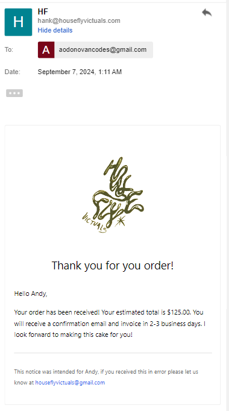
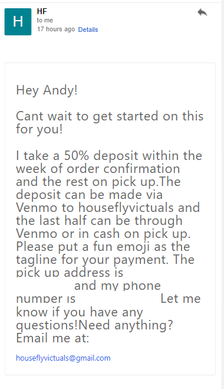

<h1>Housefly Victuals</h1>
<h2>A custom web app to take orders, make estimates, and automate transactional emails for a small business.</h2>

Housefly Victuals is a micro bakery specializing in custom cake orders. The owner had previously been doing all their business through direct messages on instagram,
and they were completely overwhelmed. I made this web app specifically for their needs.

The main pain points I wanted to address for this client were expressed as: 

<ul>
    <li> 'Having to respond to too many emails'</li>
    <li> Order validation - people frequently made requests that were impossible or out of scope for the business</li>
    <li> Calendar woes. </li>
</ul>

It's worth noting that this is not a typical e-commerce situation in that each order has to be approved by the owner. Previously they had done this all manually through instagram messages and email; a calendar had to be maintained manually with pickup dates, which dates were available etc. 

Enter the Housefly Victuals web app. A full stack NextJS app that automates all the above messy stuff

<ul>
    <li>The owner can now approve and send order confirmation emails with one click
        <ul>
        <li>owner receives a 'new order' email automatically on form submit, client gets an 'order received email' with instructions to wait</li>
        <li>owner can then log into portal and approve/reject orders. approving an order brings up a an email template with payment/pickup info that they can edit with any personal messages.</li>
        </ul>
    </li>
    <li>Strict order validation means no more invalid orders.</li>
    <li>Order form calendar is synced to a Postgres database. The calendar is updated automatically and it's no longer possible for customers to request unavailable dates.</li>
    <li>Customers can now include reference photos up to 16mb</li>
</ul>

<h3>Tech Stack</h3>
<ul>
<li>Next.js
    <ul>
    <li>custom auth strategy accomplished with server actions, middleware, and an auth api route</li>
    <li>database operations handled through server actions</li>
    <li>email templating in typescript</li>
    </ul>
</li>
<li>Resend</li>
<li>React Email</li>
<li>Vercel postrgres</li>
<li>Tailwind CSS</li>
<li>DaisyUI</li>
</ul>

<h2>Demos<h2>

<h3>Customer Experience</h3>

<video src="./public/hf-order-demo-edit2.mp4" width="800" height="400" controls></video>

<h3>Admin Experience</h3>

<h4>New Order Email<h4>
<video src="./public/newOrderBody.mp4" width="800" height="400" controls></video>
<h4>Order Management Dashboard</h4>
<video src="./public/adminDast1Redacted.mp4" width="800" height="400" controls></video>

